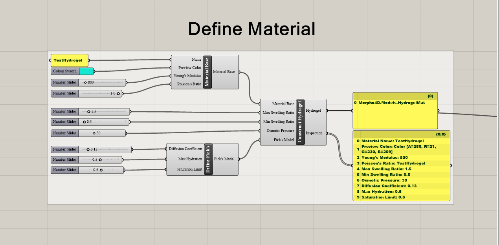
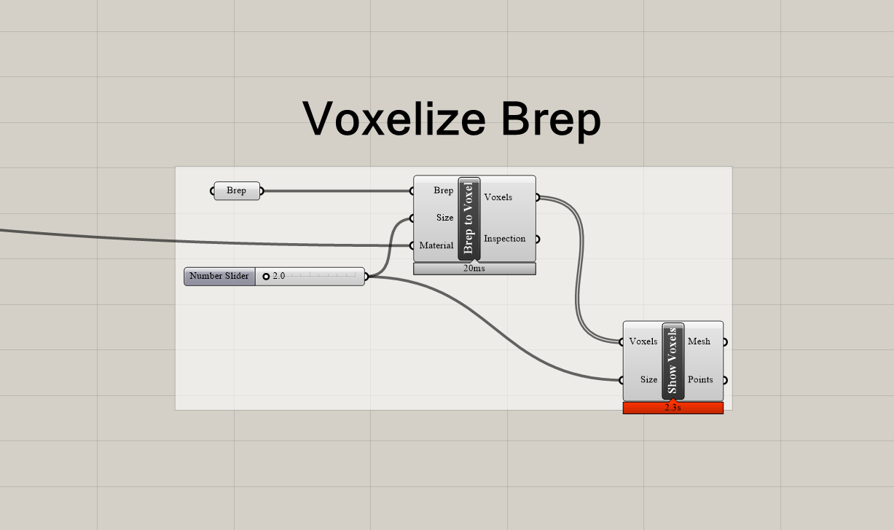
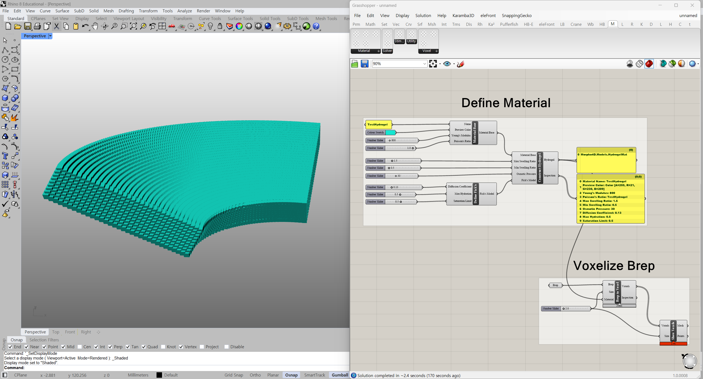
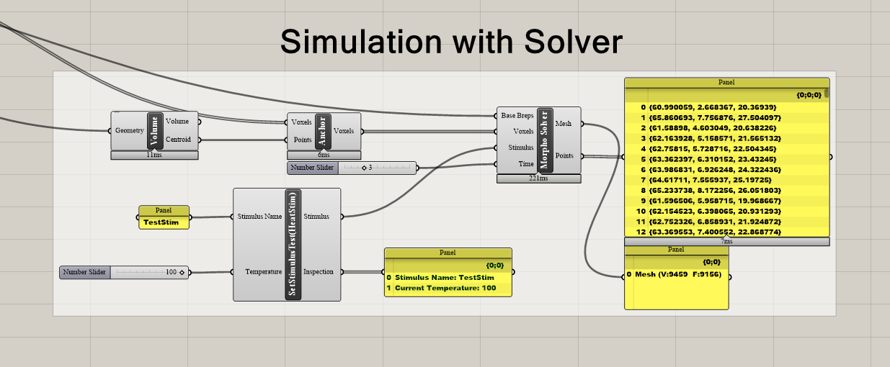
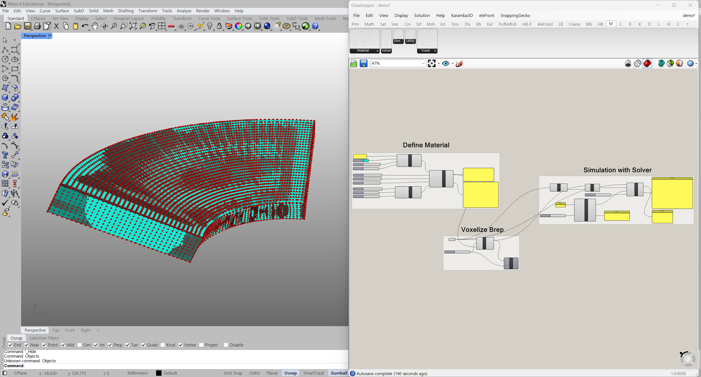
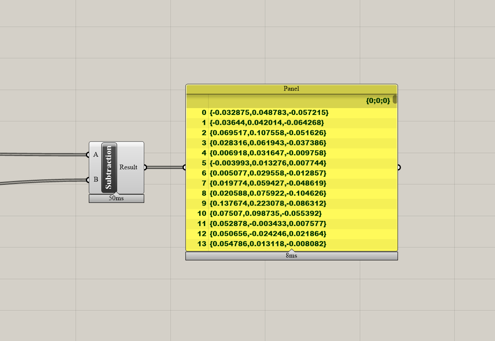

# Morpho4D for GH - Demo Version 
**Morpho4D** is a 4D printing simulation add-on for Grasshopper3D. This simulates how smart materials-such as Shape Memory Polmers (SMP) and Hydrogels-deform and respond in real-time to external stimulus. It bridges the gap between digital computational design and physical material behavior, enabling users to program, analyze, and visualize complex self-morphing geometries directly within Rhino3D. 
>Note: This project is work in progress. Some features might be unstable and buggy. We recommend you following the demo instructions below.

# Demo Instructions 
## 01 Define Material 
 
*This instruction is written for hydrogel material, but SMP material also can be used.* 
Define specific material by inputting material properties:name, color, Young's modulus, Poisson's Ratio, diffusion coefficient, max hydration, saturation limit, max/min swelling ratio, osmotic pressure.
`Material Base: Define material's basic informations before creating specific materials` 
`Define Fick's: Calculate hydrational level using Fick's law of diffusion` 
`Construct Hydrogel: Create hydrogel material by defining variables`

## 02 Voxelize Brep 
 
Voxelize input brep to generate voxel cells used for inputting material properties. **You must input only one Brep.** 
`Brep to Voxel: Convert Brep objects to Voxels` 
`Show Voxels: Show converted Voxels`

## 03 Intergrating Material Properties to Brep 
 
Connect generated material to `Brep to Voxel` component

## 04 Simulation with Solver 
 
For a stable simulation, fix the center of volume of the Brep as an anchor point before inputting into the solver. Then define stimulus and connect to solver with original Brep. You can select and view any specific simulation time step of your choice. 
`Anchor: Assigns an 'isFixed' state to specific voxels. Fixed voxels act as rigid anchors that do not move during the simulation process, allowing the rest of the structure to morph or bend around them.` 
`Morpho Solver: Simulation solver for Morpho4D` 
`SetStimulusTest(HeatStim): Test component for heat stimulus (Stimulus Class is work in progess)`

## 05 This is How PipeLine Works 
 
Result will be displayed as Mesh object and Point3D list but simulation speed and processing performance are dependent on your PC.

## 06 It may seem like nothing has changed.. 
 
If there is a difference between the voel coordinates before and after the simulation, the simulation is successful.

# What is L-BFGS? 
Limited-memory BFGS (L-BFGS or LM-BFGS) is an optimization algorithm in the collection of quasi-Newton methods that approximates the Broyden–Fletcher–Goldfarb–Shanno algorithm (BFGS) using a limited amount of computer memory...To be updated 